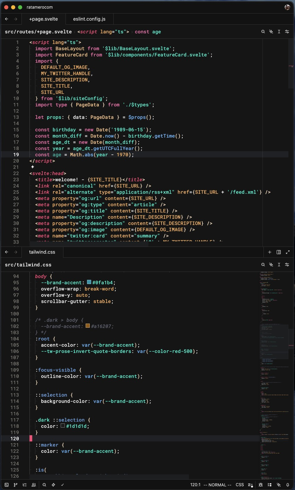
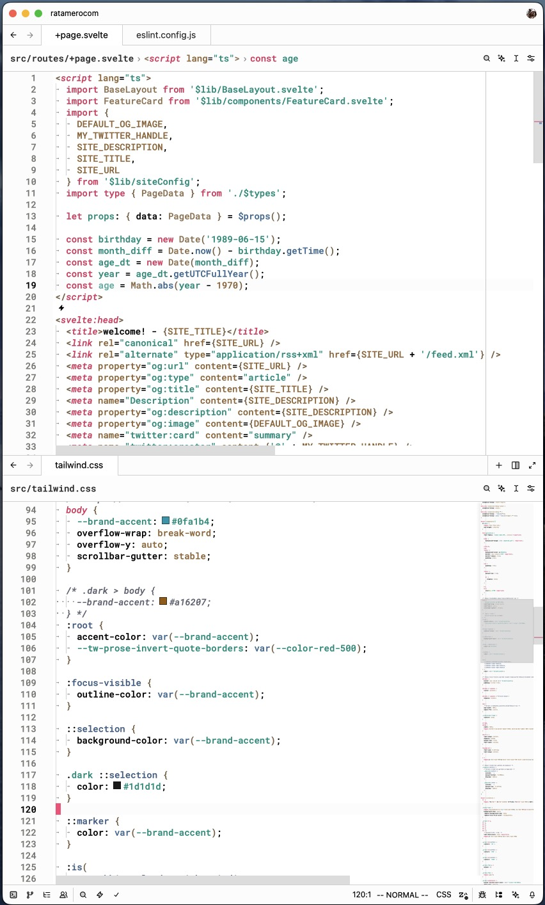

# Panda+
`variants: [Dark, Light]`

> based off of "[Panda Zed Theme](https://github.com/blaqat/panda-theme-zed)"

For those that love the Panda themes, but need more contrast. :3

I love the Panda themes, but there were two issues that I wanted to solve:

- CSS selectors and variables were the same color as basic text;
- I prefer to have more contrast on text/bg/borders.

I've added a few debug colors here and there, so I remember to fix them later, so if you find something very, very red, give me a code sample and I'll fix it!

## Preview
### Panda

## Manual Installation
1. Copy panda-plus.json to ~/.config/zed/themes/
2. Open Zed and navigate to Settings -> Theme -> Panda Lighter/Darker
